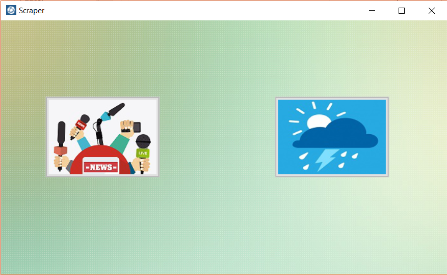
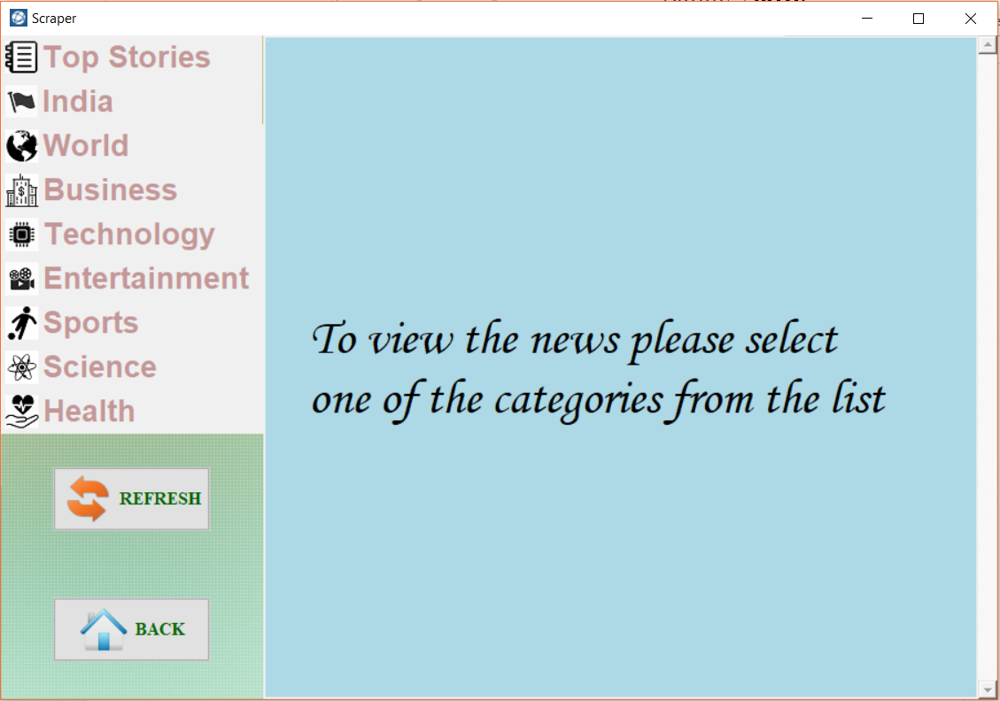
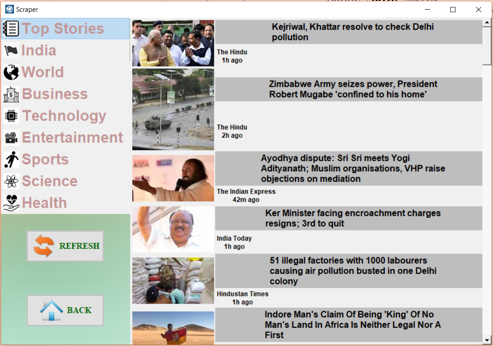
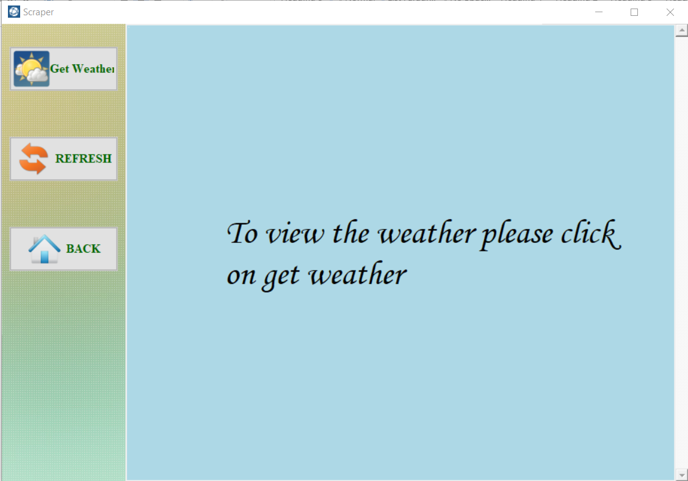

# Scraper
A web scraper with GUI that fetches news and weather of your location from the the google news.
The script is written in Python 2.7 and libraries like Tkinter, BeautifulSoup4, Pandas have been used to implement it.
To run the program simply run the "__init__.py" file on cmd or shell.

<h2>Some screenshots of the program:</h2>

 

 

 

 

 

